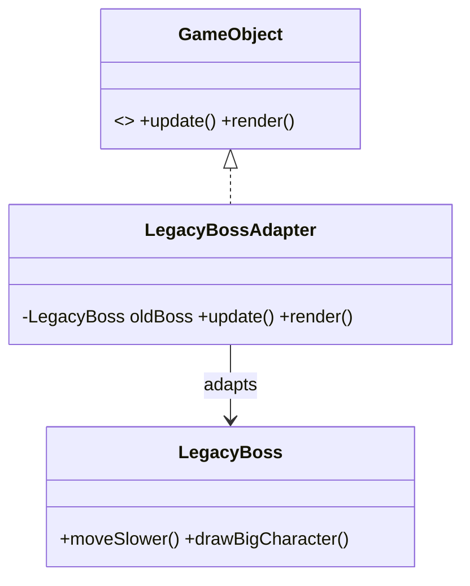
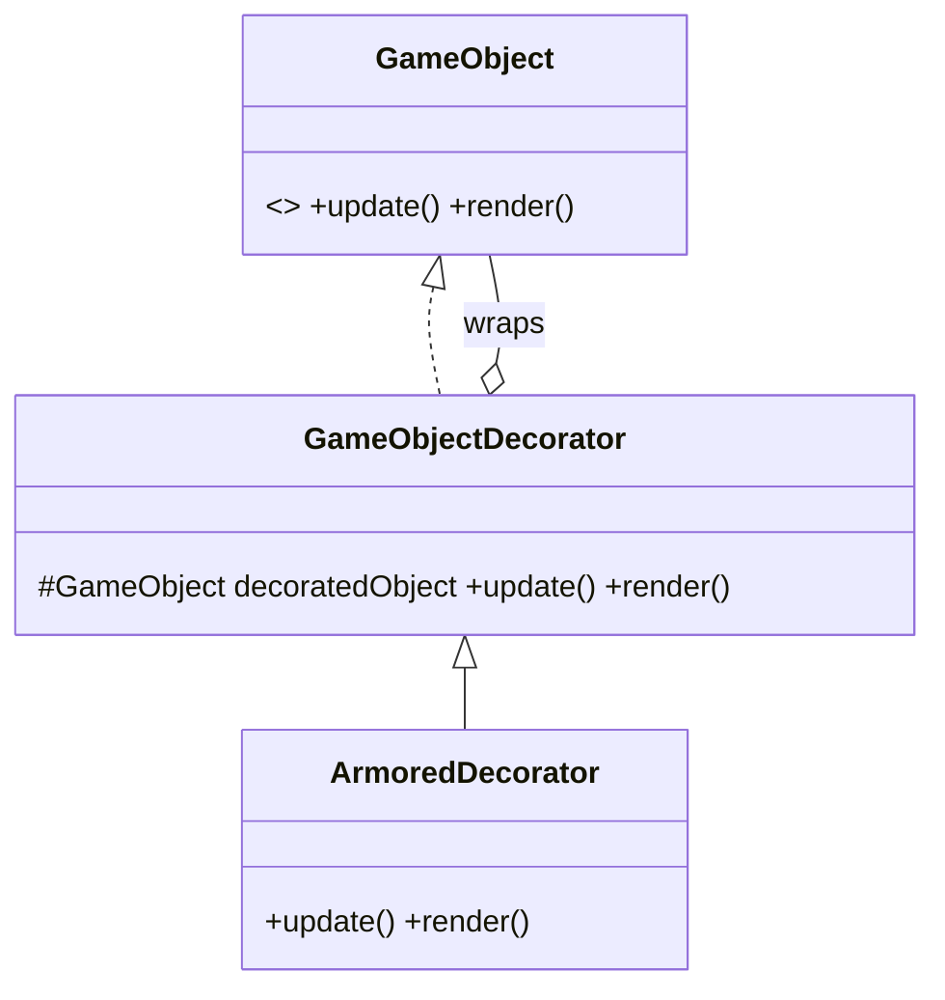
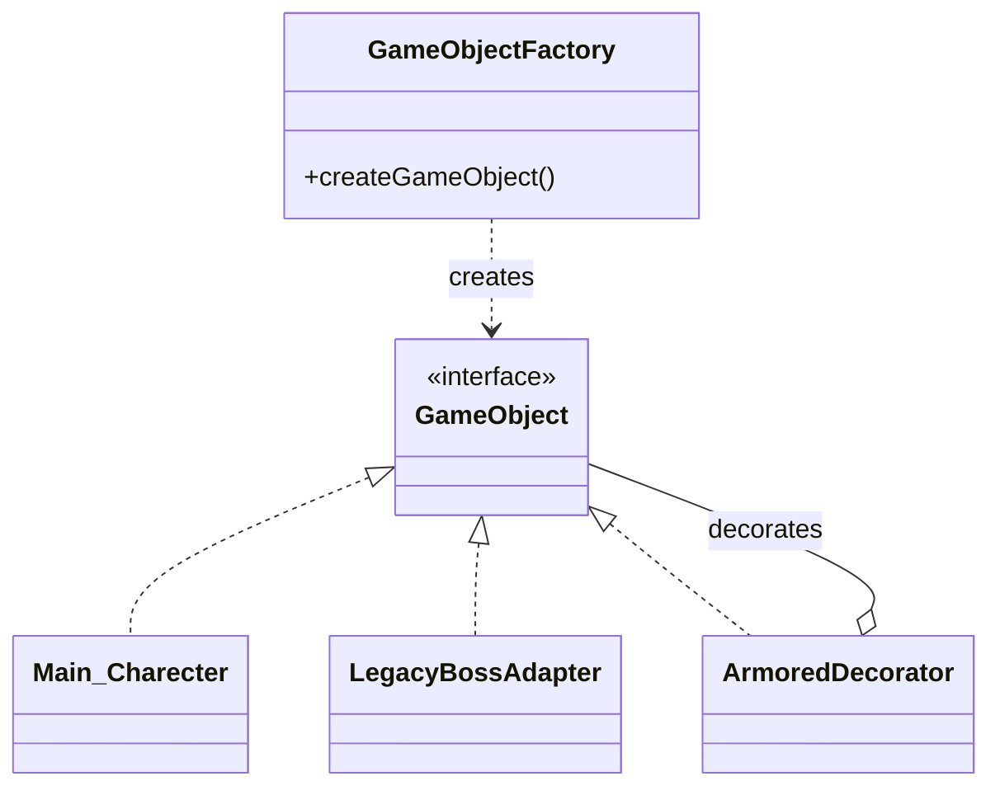

# Uygulanan Tasarım Örüntüleri

## 1. Creational Patterns (Faz 1)

### Factory Method
- **Nerede Kullanıldı:** `Game_ObjectFactory` sınıfında oyun nesnelerinin (Main_Charecter, Enemy, Health_Cure) üretiminde kullanıldı.
- **Neden Seçildi:** Nesne yaratım mantığını ana döngüden ayırarak "God Class" problemini çözmek ve yeni nesne eklemeyi esnek hale getirmek için.
- **Ne Kazandırdı:** Kodun genişletilebilirliği arttı; sisteme yeni bir karakter tipi eklemek artık ana kodu bozmuyor.

---

## 2. Structural Patterns (Faz 2)

### A. Adapter Pattern
- **Nerede Kullanıldı:** `LegacyBossAdapter` sınıfında, eski sistemden gelen `LegacyBoss` sınıfını sisteme entegre etmek için kullanıldı.
- **Neden Seçildi:** Mevcut `GameObject` arayüzüne (interface) uymayan ancak sistemde kullanılması gereken eski bir kod yapısını, ana sistemi değiştirmeden "adapte" etmek için en uygun yöntemdi.
- **Alternatiflerin Reddi (Facade vs Adapter):** Projede karmaşık bir alt sistem (fizik motoru, ses motoru vb.) değil, sadece tek bir uyumsuz sınıf söz konusu olduğu için *Facade* örüntüsü gereksiz karmaşık bir çözüm olarak görüldü ve reddedildi.

#### Adapter UML Diyagramı:

### B. Decorator Pattern
- **Nerede Kullanıldı:** `ArmoredDecorator` sınıfında, oyuncu nesnesine dinamik olarak zırh özelliği kazandırmak için kullanıldı.
- **Neden Seçildi:** Bir nesnenin temel sınıf kodunu değiştirmeden, çalışma zamanında (runtime) ona esnek ve istiflenebilir özellikler ekleyebilmek için seçildi.
- **Alternatiflerin Reddi (Kalıtım vs Decorator):** Klasik *Kalıtım (Inheritance)* yöntemi reddedildi; çünkü her özellik kombinasyonu (Zırhlı, Hızlı, Ateşli vb.) için ayrı alt sınıf oluşturmak "Class Explosion" (sınıf patlaması) problemine yol açacaktı.

#### Decorator UML Diyagramı:

---

## 3. Faz 2 Mimari Genel Görünümü
Faz 2 sonunda sistem; fabrikadan çıkan nesnelerin hem adaptörler aracılığıyla dış sistemlere bağlanabildiği hem de dekoratörler ile dinamik olarak geliştirilebildiği bir yapıya evrilmiştir.

