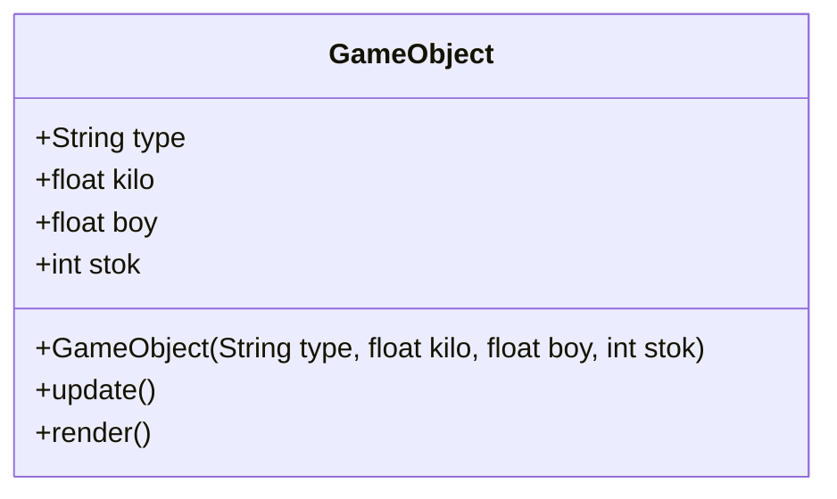
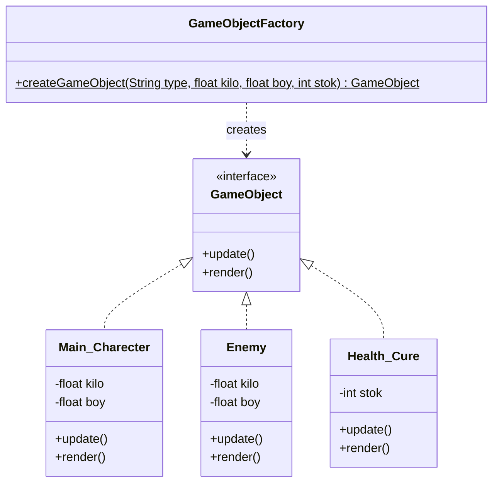

# Uygulanan Tasarım Örüntüleri

## 1. Factory Method (Faz 1)

- **Nerede Kullanıldı:** `GameObjectFactory` sınıfında oyun nesnelerinin üretiminde kullanıldı.
- **Neden Seçildi:** Başlangıç kodundaki `GameObject` sınıfı bir "God Class" haline gelmişti ve nesne yaratımı esnek değildi. Factory Method ile yaratım sorumluluğunu tek bir merkeze çektim.
- **Ne Kazandırdım:** Sisteme yeni bir nesne (örneğin "BOSS") eklemek istediğimde ana kodum kırılmayacak. Sadece fabrikaya yeni bir durum eklemem yeterli olacak.

### UML Sınıf Diyagramı (Öncesi ve Sonrası)

**Öncesi (God Class - Spagetti Kod):**

**Sonrası (Factory Method Uygulanmış Hali):**
